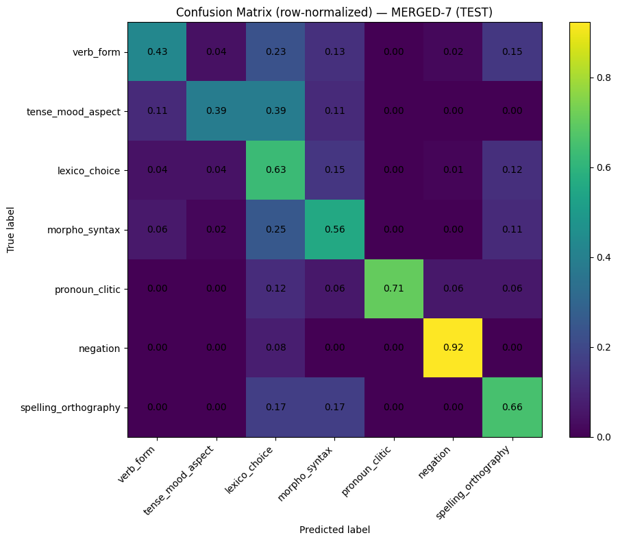

# French Learner Error Classification

## Project Overview

This project investigates **sentence-level classification of learner errors in French** using machine learning and transformer-based models.

The objective is to automatically predict the **type of linguistic error** present in a learner sentence. Such systems can support:

* language learning tools
* automated grammar correction
* learner corpus analysis
* educational NLP applications

The project combines **linguistic annotation principles** with **modern NLP models**, exploring how well neural models can distinguish fine-grained learner error categories.

---

# Task

Given a learner sentence containing an error, the model predicts **the error type** according to a predefined taxonomy.


Learner sentence:
Les personne arrive en retard.

Predicted label:
morpho_syntax


The task is framed as a **multi-class sentence classification problem**.

---

# Error Taxonomy

The original taxonomy contains **10 error categories**:

* verb_form
* tense_mood_aspect
* lexical_choice
* agreement
* word_order
* pronoun_clitic
* preposition
* determiner_article
* negation
* spelling_orthography

Detailed annotation guidelines are provided in:

```
docs/annotation_guidelines.md
```

---

# Data Sources

Two types of data were used.

### 1. Learner data

Learner sentences derived from **Lang-8**.

These sentences contain **naturally occurring learner errors**.

They were manually annotated using the error taxonomy described in the annotation guidelines.

### 2. Synthetic learner sentences

Additional training data was created by **injecting controlled errors into clean Wikipedia sentences**.

This synthetic data increases the amount of training examples for specific error types.

---

# Dataset Structure

The final experiments use four datasets:

```
train_syn_clean.csv
train_real_clean.csv
gold_val_clean.csv
gold_test_clean.csv
```

Expected columns:

```
learner_sentence
label
```

Due to licensing and annotation constraints, the datasets are **not distributed in this repository**.

More details are available in:

```
data/README.md
docs/data_notes.md
```

---

# Modeling Pipeline

The project explores several modeling approaches.

## Baseline

A classical NLP baseline using:

```
TF-IDF + Logistic Regression
```

Purpose:

* establish a simple reference model
* detect potential dataset leakage
* measure the benefit of contextual models

Baseline performance:

```
Macro-F1 ≈ 0.27 (gold_val)
```

---

# Transformer Models

The main experiments use **CamemBERT**, a transformer pretrained on large-scale French corpora.

CamemBERT produces **contextual embeddings**, allowing the model to capture:

* syntactic dependencies
* lexical selection
* contextual meaning

This is particularly important for learner error detection, where many errors depend on **sentence context**.

---

# Training Strategies

Two main training strategies were explored.

### Two-stage training

1. Train on synthetic data
2. Fine-tune on real learner sentences

Validation performance:

```
Macro-F1 ≈ 0.43
```

---

### Mixed training

Synthetic and real learner data are **concatenated during training**.

Validation performance:

```
Macro-F1 ≈ 0.49
Accuracy ≈ 0.46
```

This configuration produced the best results and was used for further experiments.

---

# Additional Experiments

Several improvements were tested on top of the best mixed training setup:

* weighted loss (class imbalance mitigation)
* lower learning rate (1e-5)
* label smoothing
* oversampling of rare classes
* intermediate fine-tuning

These experiments helped evaluate the robustness of the model but did not substantially outperform the best mixed training configuration.

---

# Error Analysis

Confusion matrix analysis revealed systematic confusion between several categories, especially:

```
lexical_choice
preposition
word_order
```

and

```
agreement
determiner_article
```

These categories often overlap linguistically and are difficult to separate in short learner sentences.

---

# Taxonomy Refinement

To address this issue, ambiguous categories were merged.

### Merge 1

```
agreement + determiner_article → morpho_syntax
```

### Merge 2

```
lexical_choice + preposition + word_order → lexico_choice
```

The final taxonomy therefore contains **7 classes**.

---

# Final Results

Evaluation on the held-out **gold_test** set:

```
Accuracy ≈ 0.58
Macro-F1 ≈ 0.616
```

These results suggest that a **slightly coarser taxonomy aligns better with what the model can reliably learn**, reducing systematic confusion between linguistically related categories.

---
## Confusion Matrix

Below is the row-normalized confusion matrix of the final 7-class model on the held-out test set.



---
# Repository Structure

```
french-learner-error-classification
│
├── notebooks
│   ├── Preprocessing_FinalProject_NLP.ipynb
│   ├── Baseline_FinalProject.ipynb
│   └── Fine_tune_FinalProject.ipynb
│
├── data
│   ├── README.md
│   └── .gitkeep
│
├── docs
│   ├── annotation_guidelines.md
│   └── data_notes.md
│
├── models
│   └── .gitkeep
│
├── outputs
│   ├── cm_merged7_test.png
│   └── .gitkeep
│
├── .gitignore
└── README.md
```

---

# Notebooks

The repository contains three main notebooks:

**Preprocessing**

Dataset loading, cleaning, and split preparation.

**Baseline**

TF-IDF + Logistic Regression experiments.

**Fine-tuning**

Transformer training with CamemBERT and experimental variants.

---

# Author

PhD in Linguistics with a focus on **linguistically informed NLP** and learner language analysis.

This project explores how linguistic annotation and machine learning can be combined to improve automatic error classification in learner corpora.

---

# Future Work

Possible extensions include:

* larger learner corpora
* multi-label error annotation
* token-level error detection
* integration with grammatical error correction systems

---